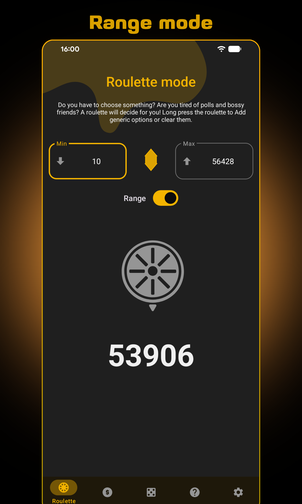
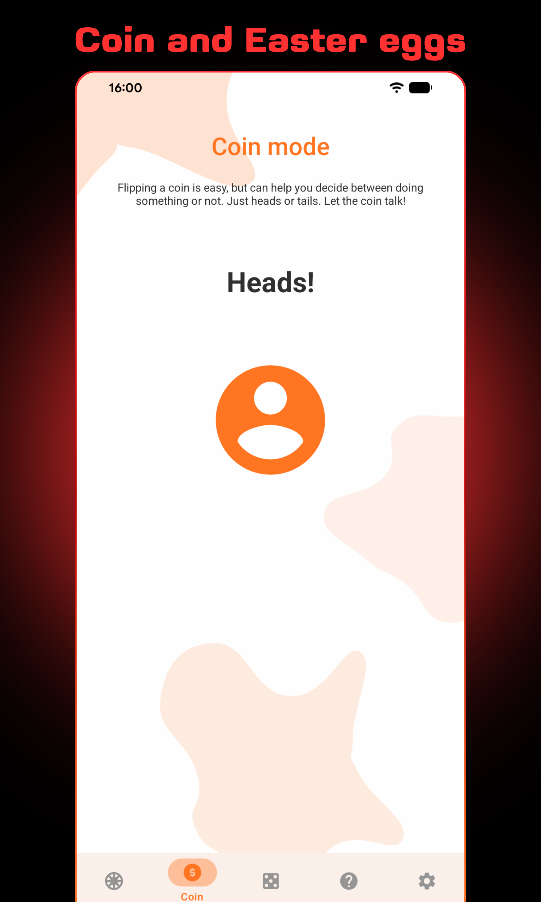
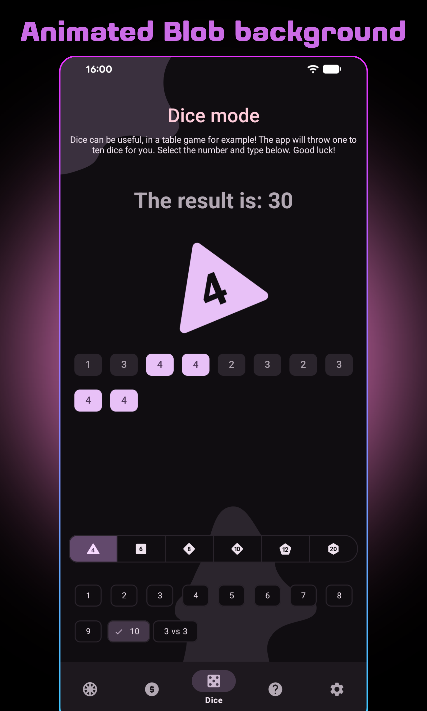
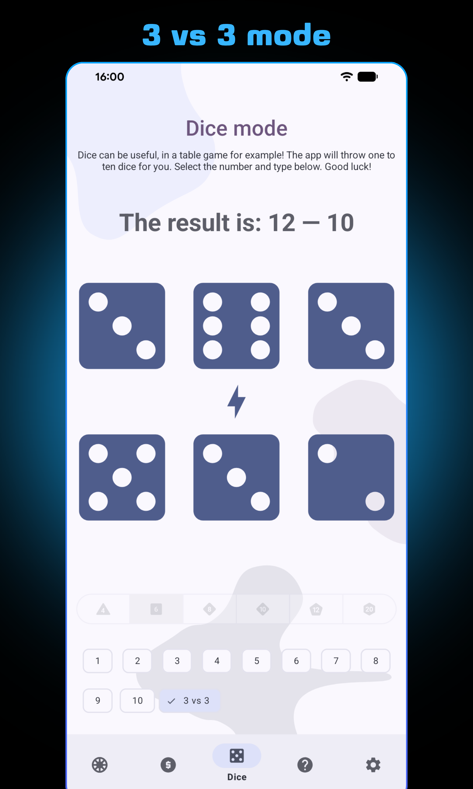
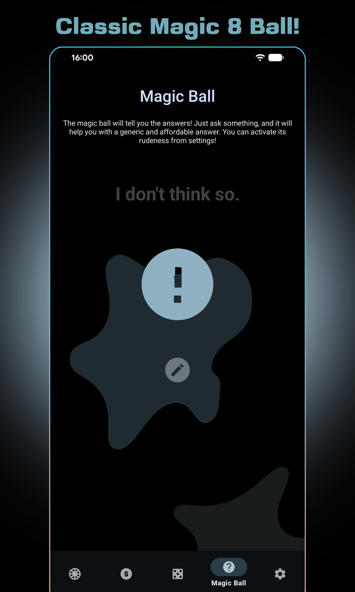
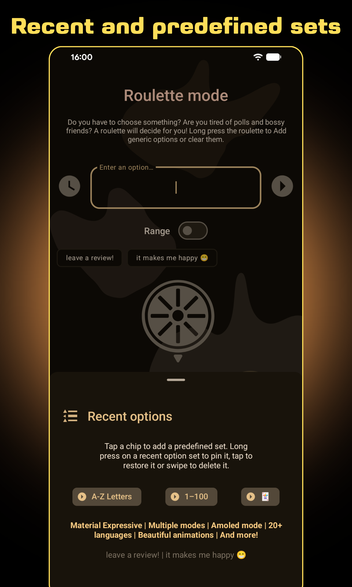
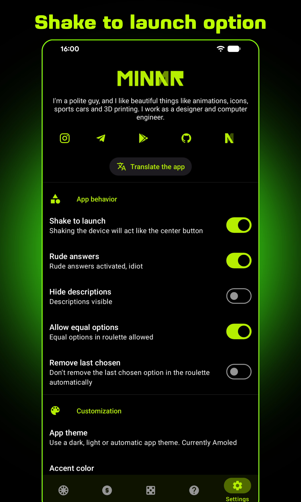
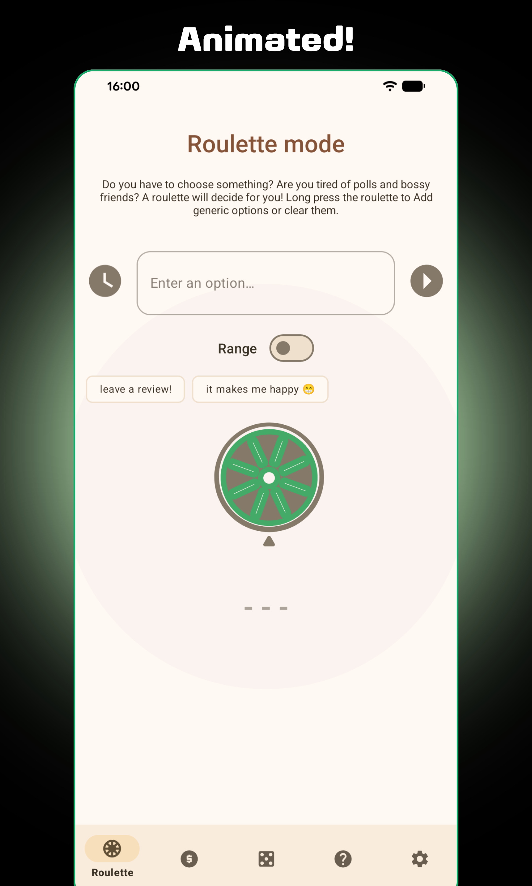
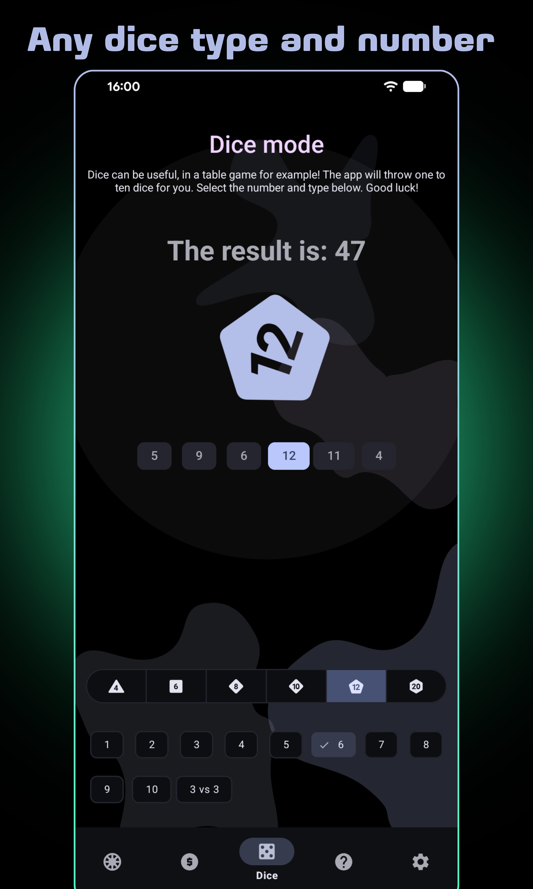
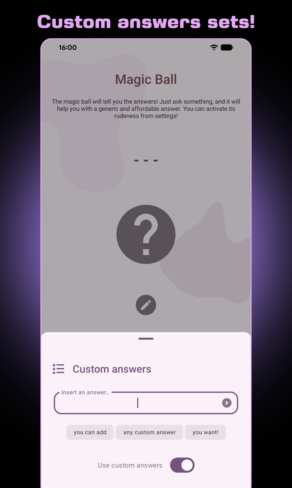

# Randomix

An open source app to choose randomly between numbers, answers, options and so on.

  
  
  

## Introduction

This is an open source app created to experiment some new android features, but it's also available
on Play Store and F-Droid for all users.
The main purpose of the app is provide a **random choice** in different ways. The app contains some
basic personalization options and an introduction, plus a lot of **animated vector drawables**. The
design is a bit personal, but it mostly follows the guidelines.

## Translations (refer to [Crowdin](https://crowdin.com/project/randomix))

| LANGUAGE               |            SPECIAL THANKS |
|:-----------------------|--------------------------:|
| **English**            |           myself, cosmojg |
| **Italian**            |                    myself |
| **Spanish**            |                    myself |
| **German**             | deep-ocean-fish, julius-d |
| **Russian**            |                    BValeo |
| **French**             |                   Firokat |
| **Portuguese**         |              Kiskadee-dev |
| **Brazilian**          |              Kiskadee-dev |
| **Czech**              | Miloš Koliáš, mormegil-cz |
| **Simplified Chinese** |                    pumguy |
| **Indonesian**         |           the7thNightmare |
| **Chinese (Taiwan)**   |                   Still34 |
| **Asturian**           |                 Softastur |
| **English (GB)**       |              SecularSteve |
| **Dutch**              |              SecularSteve |
| **Bosnian**            |              SecularSteve |
| **Croatian**           |              SecularSteve |
| **Serbian**            |              SecularSteve |
| **Serbian (latin)**    |              SecularSteve |

Special thanks to Nickoriginal for the overall improvement of each translation

## Features

- Every tab in the bottom navigation bar contains a type of random choice. The available types are:
    - **Roulette** -> chooses between a specified number of options or a custom number range,
      entered from the user. Includes a list of recent options easy to select, pin, delete or
      restore.
    - **Coin** -> simply flips a coin and prints the result.
    - **Dice** -> throws a chosen number/type of dice and prints the result.
    - **Magic Ball** -> provides randomly chosen answers to any question.
- Light, dark and Amoled themes (Automatic dark mode supported)
- Full Material You support
- Selectable accent (no app restart needed)
- Up to 10 dice, 3v3 mode, d4, d6, d10, d12, d20
- The app remembers the last used mode
- Roulette presets for letters, cards and numbers
- Custom ranges (values from 0 to 99999)
- Customizable magic ball answers
- Multiwindows support
- Android 12 animated splashscreen supported
- Android 13 per-app language support
- Android 13 themed icon support
- First time introduction
- Rate the app dialog
- Simple and precise UI, following Google guidelines
- Allow equal options, dice number, rude answers, remove last chosen option in the roulette
- Sounds, vibration and other options
- Small size (~4MB), optimized code
- Available in many languages (see the table above)

## Screenshots

  
  
  
  
  

  
  
  
  
  

## Download

The app is now available through Google Play and F-Droid.

## Credits and contributions

Randomix uses an open source library:

- [App Intro](https://github.com/AppIntro/AppIntro)

Currently, Randomix supports the languages in the above table. If you want to translate the app in
any other language or update an existing translation, just contact me or send a pull request: you'll
be quoted both on Github and in the Play Store description.

This app was written during my free time as a training. It was first published on June 1, 2018. Many
good devs have helped me understanding the best practices and they taught me a lot of useful tricks.
A special thank to every contributor. and God bless Stack Overflow.
